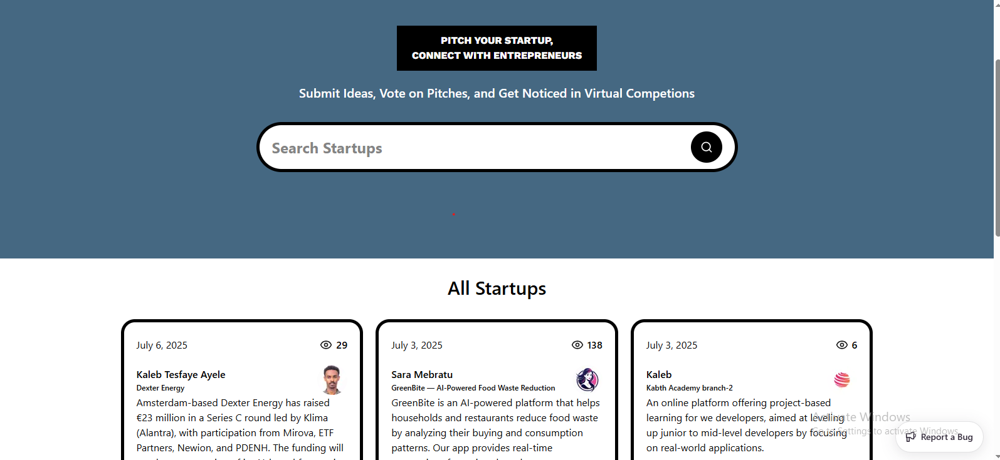
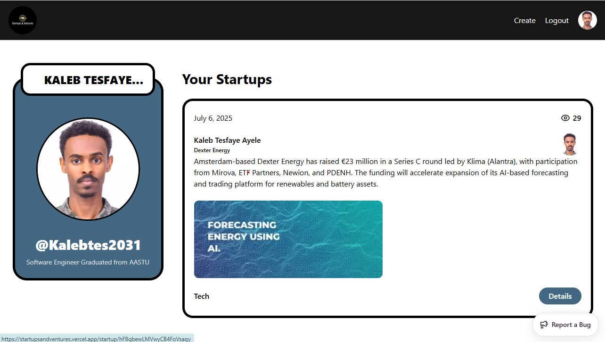
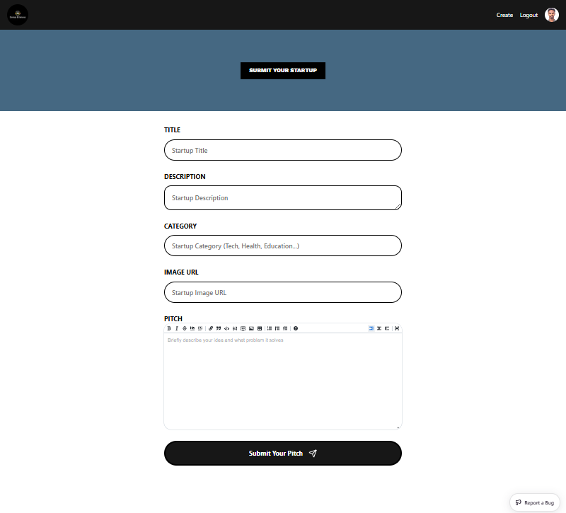

Here’s a **professional `README.md`** file for your project **“Startup and Ventures”**, tailored for GitHub. You can copy and paste this directly into your repository’s `README.md` file.

---

````markdown
# 🚀 Startup and Ventures

A modern web application to explore and share startup ideas and ventures — built with **Next.js**, **Sanity Studio**, and integrated with **Sentry** for robust error monitoring.

## 🌐 Live Demo

👉 Visit the app here: [https://startupsandventures.vercel.app](https://startupsandventures.vercel.app)

Help us grow this open collection of innovative startup ideas by browsing or submitting your own!

---


## ✨ Features

- 🔐 **GitHub OAuth Authentication**  
  Easily log in using your GitHub account.

- 📝 **Startup Submission Form with Markdown Support**  
  Authenticated users can create and submit startups with rich text formatting using a markdown-like input.

- 🌍 **Public Startup Collection**  
  All visitors — logged in or not — can browse the list of submitted startups and ventures.

- 🎯 **Sanity Studio Integration**  
  Headless CMS backend to manage and store content efficiently.

- ⚠️ **Sentry Integration**  
  For monitoring errors, performance, and ensuring application reliability.

---

## 🔧 Tech Stack

| Tech       | Purpose                      |
|------------|------------------------------|
| [Next.js](https://nextjs.org/) | Frontend framework (React-based) |
| [Sanity](https://www.sanity.io/) | CMS for content management |
| [Sentry](https://sentry.io/) | Error tracking and performance monitoring |
| [GitHub OAuth](https://docs.github.com/en/developers/apps/building-oauth-apps) | Authentication |

---

## 📸 Screenshots

### Home Page



### Profile Page



### Submit Startup Page




---

## 🚀 Getting Started

### Prerequisites

- Node.js ≥ 16
- npm or yarn
- GitHub OAuth credentials
- Sanity project & dataset

### 1. Clone the Repository

```bash
git clone https://github.com/Kalebtes2031/Startup.git
cd Startup
````

### 2. Install Dependencies

```bash
npm install
# or
yarn install
```

### 3. Setup Environment Variables

Create a `.env.local` file and configure the following:

```env
NEXT_PUBLIC_SANITY_PROJECT_ID=your_sanity_project_id
NEXT_PUBLIC_SANITY_DATASET=your_dataset
SANITY_API_TOKEN=your_sanity_token

GITHUB_CLIENT_ID=your_github_client_id
GITHUB_CLIENT_SECRET=your_github_client_secret

SENTRY_DSN=your_sentry_dsn
```

### 4. Run the Development Server

```bash
npm run dev
# or
yarn dev
```

Visit [http://localhost:3000](http://localhost:3000) to see the app.

---

## 📦 Deployment

You can deploy this app using platforms like **Vercel**, **Netlify**, or your custom server setup. Make sure to set the environment variables in your deployment dashboard.

---


---

## 🤝 Contributing

Contributions are welcome! Feel free to submit a pull request or open an issue.

---

## 📄 License

This project is licensed under the MIT License.

---

## 🧠 Author

**Kaleb Tesfaye**

* GitHub: [@Kalebtes2031](https://github.com/Kalebtes2031)
* LinkedIn: [https://www.linkedin.com/in/kaleb-tesfaye-247146234/](https://www.linkedin.com/in/kaleb-tesfaye-247146234/)

```

